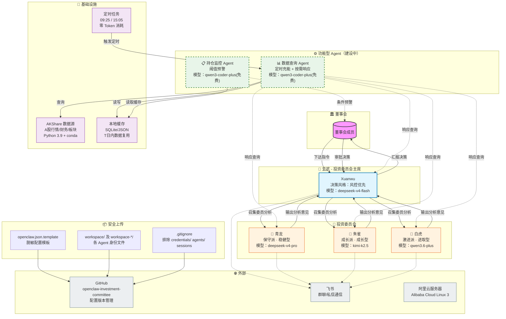
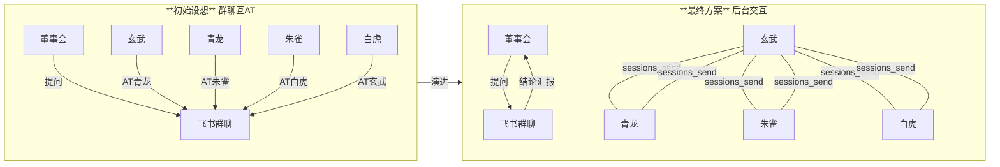

# OpenClaw 投资委员会架构图



---

## 完整架构说明

### 信息流

```
董事会 ──(议题)──→ 玄武 ──(委员召集)──→ 青龙 / 朱雀 / 白虎
                                    ↑                     │
                                    │      ┌──────────────┘
                                    │      ▼
                                    └──(分析意见)──
                                                  │
                                                  ▼
玄武 ──(综合决策)──→ 董事会
```

### 数据流

```
数据查询 Agent ←―(定时 09:25/15:05)― 定时任务
      │
      ├──(查数据)──→ AKShare ──→ 东方财富/新浪/同花顺
      │
      └──(写入/读取)──→ 本地缓存
              │
              ├──(读取)──→ 持仓监控 Agent
              │
              └──(读取)──→ 委员 Query

委员 Query 路径：
  委员提问 → 数据 Agent(qwen3-coder-plus)
           → 匹配脚本 → Python 脚本调 AKShare
           → 格式化输出 → 返回
```

### 关键设计决策

| 决策 | 理由 |
|---|---|
| 数据+监控 Agent 分离 | 职能不同，互不干扰 |
| 定时任务零 Token | Python 脚本直调 AKShare，不走模型 |
| miniconda 隔离 Python 3.9 | 不碰系统 Python 3.6，独立管理 |
| openclaw.json.template | 生产配置脱敏后上传 GitHub |
| 免费模型优先 | 数据 Agent 仅做匹配转发，几乎零推理 |

---

## 通信架构演进



| 对比维度 | 初始设想（群聊互@） | 最终方案（后台通信） |
|---|---|---|
| 群聊成员 | 4 个机器人 + 董事会 | 仅 1 个机器人（玄武）+ 董事会 |
| 委员讨论 | 群内 @ 对方，可见 | 后台 session_send，不可见 |
| 消息量 | 每条讨论都刷屏 | 只有提问和结论，干净 |
| 技术复杂度 | 需装社区插件、有信道冲突 | 零插件，OpenClaw 原生支持 |
| 可读性 | 消息爆炸，难以追踪 | 一条提问→一条结论，清晰 |

### 当前状态

- ✅ **已完成**：委员会主席（玄武）+ 三位委员（青龙/朱雀/白虎）
- ✅ **已完成**：GitHub 版本管理（脱敏模板 + 排除敏感文件）
- ✅ **已完成**：Python 3.9 + AKShare 基础设施
- 🔄 **待建设**：数据查询 Agent
- 🔄 **待建设**：持仓监控 Agent
